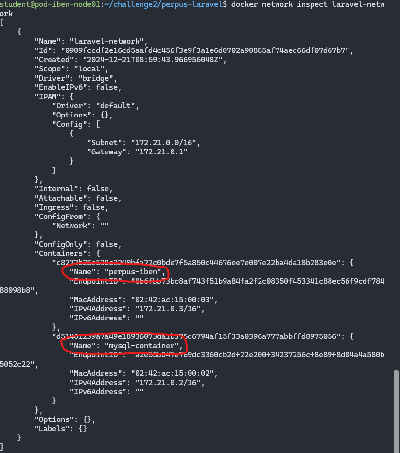
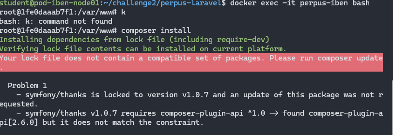
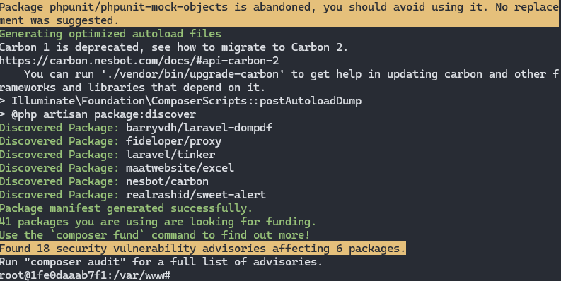
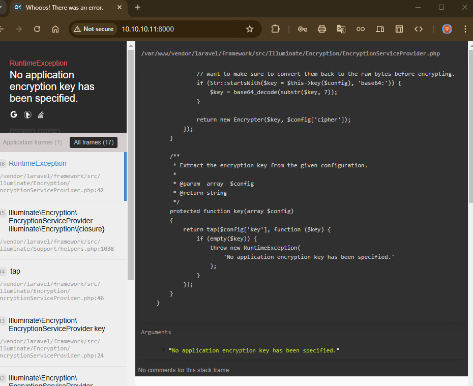
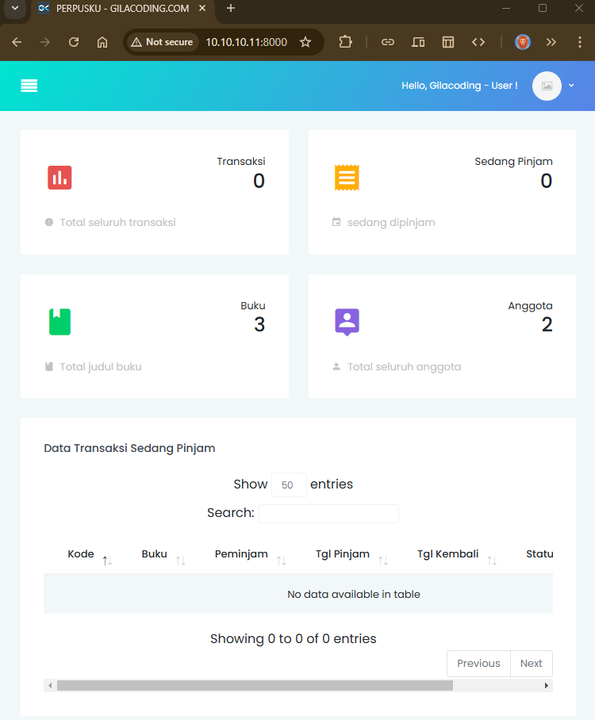

# Setup Aplikasi Laravel dengan Docker

Panduan ini menjelaskan cara menyiapkan aplikasi Laravel di dalam container Docker, dengan database MySQL yang terhubung dan otomatis menjalankan perintah migrasi dan seeding saat container berjalan.

## Langkah 1: Membuat Direktori dan Clone Repository

1. Buat direktori baru dan masuk ke dalamnya:

    ```bash
    mkdir challenge2
    cd challenge2
    ```

2. Clone repository Laravel dari GitHub:

    ```bash
    git clone https://github.com/academynusa/perpus-laravel.git
    cd perpus-laravel
    ```

## Langkah 2: Membuat Dockerfile
```bash
# pastikan saat membuat Dockerfile kiat berada di directory perpus-laravel
sudo nano Dockerfile
```

Buat file `Dockerfile` di dalam direktori `challenge2` dengan isi berikut:

```Dockerfile
# Gunakan base image PHP 7.2
FROM php:7.2-fpm

RUN apt-get update && apt-get install -y \
    git \
    curl \
    zip \
    unzip \
    libpng-dev \
    libjpeg-dev \
    libfreetype6-dev \
    libonig-dev \
    libxml2-dev \
    libzip-dev \
    default-mysql-client \
    && docker-php-ext-install pdo_mysql mbstring zip gd

# Install Composer
COPY --from=composer:2 /usr/bin/composer /usr/bin/composer

# Set working directory
WORKDIR /var/www

# Copy semua file Laravel ke dalam container
COPY . .

# Expose port 8000 untuk aplikasi
EXPOSE 8000

# Copy dan jalankan script setup
COPY setup.sh /usr/local/bin/setup.sh
RUN chmod +x /usr/local/bin/setup.sh

# Jalankan setup script saat container mulai
CMD ["bash", "/usr/local/bin/setup.sh"]
```

## Langkah 3: Membuat Script Automasi `setup.sh`
```bash
sudo nano setup.sh
```
Salin semua isi script Automation ini

```bash
#!/bin/bash

# Masuk ke direktori Laravel
cd /var/www

# Install dependensi Laravel (gunakan composer install jika sudah ada composer)
composer install

# Jika file .env belum ada, salin .env.example
if [ ! -f .env ]; then
  cp .env.example .env
fi

# Atur konfigurasi database di .env
sed -i '/DB_DATABASE=/c\DB_DATABASE=perpusku_gc' .env
sed -i '/DB_USERNAME=/c\DB_USERNAME=root' .env
sed -i '/DB_PASSWORD=/c\DB_PASSWORD=password' .env

# Setelah Konfigurtasi di buat  ini akan menyimpan ke folder default nya
COPY .env /var/www/.env

# Generate APP_KEY jika belum ada
php artisan key:generate

# Jalankan migrasi dan seed database
php artisan migrate --force
php artisan db:seed --force

# Jalankan Laravel di port 8000
php -S 0.0.0.0:8000 -t public
```

## Langkah 4. Build dan Menjalankan Container
```bash
# Sesuaikan dengan username nya
docker build -t img-perpus-username .
```

```bash
# Sesuaikan dengan username nya
docker run -d --name perpus-username -p 8000:8000 img-perpus-username
```

1. `-d`: Menjalankan container di background.
2. `--name` perpus-username: Memberi nama container.
3. `-p 8000:8000`: Menghubungkan port 8000 container ke port 8000 host.

```bash
# Melihat Docker yang berjalan dan pastikan container yang kita buat itu ada
docker ps
```
## Langkah 5. Cek Database dan Konfigurasi Network

Pastikan database **perpusku_gc** tersedia dan dapat diakses. Jika database berjalan di container lain:

```bash
# Buat Networknya
docker network create laravel-network
```

```bash
# Memastikan network yang telah di buat ada
docker network ls
```

```bash
# Melihat Container apa saja yang berada di network yang sama
docker network inspect laravel-network
```

```bash
# Jalankan database dengan jaringan tersebut
docker run -d --name mysql-container --network laravel-network -e MYSQL_DATABASE=perpusku_gc -e MYSQL_ROOT_PASSWORD=password mysql:5.7
```

```bash
# Setelah container database telah di buat pastikan database tersebut berjalan di container
docker ps
```

Pastikan ada `2 Container` yang berjalan yaitu container dari `perpus-iben` dan `mysql-container` pastikan mereka saling terhubung dengan menggunakan **Network** yang sama.


Pastikan kedua container (`perpus-iben` dan `mysql-container`) berada dalam jaringan yang sama, Karena disini kita tidak menggunakan `docker-compose` kita perlu menghubungkan kontainernya

```bash
# Memastikan network yang telah di buat ada
docker network ls
```

```bash
# Menghubungkan Kedua kontainer agar bisa saling terhubung
docker network connect laravel-network perpus-iben
docker network connect laravel-network mysql-container
```

```bash
# Mengecek cantainer apa saja yang terhubung di network laravel
docker network inspect laravel-network
```


Setelah memastikan 2 container terhubung dengan network yang sama

```bash
# Masuk ke dalam container yang berjalan pastikan file .env sudah sesuai
docker exec -it perpus-iben bash
```
Pastikan file dari .env sudah sesuai
```bash
# Didalam directory Memeriksa isi .env
cat .env
```


## Langkah 6. Menginstal dan Update Composer

```bash
# Masuk ke dalam container yang berjalan pastikan file .env sudah sesuai
docker exec -it perpus-iben bash
```

```bash
# Menginstal packages yang ada di dalam docker container
composer install
```
Jika mengalami seperti ini 



Masukkan:
```bash
# mengaupdate packages yang ada di docker container
composer update
```


Akses menggunakan `ip_server dan port yang berjalan`, disini saya menggunakan IP 10.10.10.11 dari VirtualBox

```bash
# Akses kedalam Browser
http://10.10.10.11:8000
```



Jika error seperti ini masukkan `key` untuk `.env`, Error seperti ini di biasanya di akibatkan database belum di migrate dengan baik sehingga database tidak dapat terbaca.
```bash
php artisan key:generate
```

```bash
php artisan migrate
```


```bash
php artisan db:seed
```


Setelah semuanya dijalankan dengan baik dan tidak ada error lagi tampilan web akan seperti berikut:


