# Setup Aplikasi Laravel dengan Docker

Ini menjelaskan cara menyiapkan aplikasi Laravel di dalam container Docker, dengan database MySQL yang terhubung dan otomatis menjalankan perintah migrasi dan seeding saat container berjalan.

## Langkah 1: Membuat Direktori dan Clone Repository

1. Buat direktori baru dan masuk ke dalamnya:

    ```bash
    mkdir challenge2
    cd challenge2
    ```

2. Clone repository Laravel dari GitHub:

    ```bash
    git clone https://github.com/academynusa/perpus-laravel.git
    cd perpus-laravel
    ```

## Langkah 2: Membuat Dockerfile

```bash
# pastikan saat membuat Dockerfile kiat berada di directory perpus-laravel
sudo nano Dockerfile
```

Buat file `Dockerfile` di dalam direktori `challenge2` dengan isi berikut:

```Dockerfile
# Gunakan base image PHP 7.2
FROM php:7.2-fpm

RUN apt-get update && apt-get install -y \
    git \
    curl \
    zip \
    unzip \
    libpng-dev \
    libjpeg-dev \
    libfreetype6-dev \
    libonig-dev \
    libxml2-dev \
    libzip-dev \
    default-mysql-client \
    && docker-php-ext-install pdo_mysql mbstring zip gd

# Install Composer
COPY --from=composer:2 /usr/bin/composer /usr/bin/composer

# Set working directory
WORKDIR /var/www

# Copy semua file Laravel ke dalam container
COPY . .

# Expose port 8000 untuk aplikasi
EXPOSE 8000

# Copy dan jalankan script setup
COPY setup.sh /usr/local/bin/setup.sh
RUN chmod +x /usr/local/bin/setup.sh

# Jalankan setup script saat container mulai
CMD ["bash", "/usr/local/bin/setup.sh"]
```

## Langkah 3: Membuat Script Automasi `setup.sh`
```bash
sudo nano setup.sh
```
Salin semua isi script Automation ini

```bash
#!/bin/bash

# Masuk ke direktori Laravel
cd /var/www

# Install dependensi Laravel (gunakan composer install jika sudah ada composer)
composer install

# Jika file .env belum ada, salin .env.example
if [ ! -f .env ]; then
  cp .env.example .env
fi

# Atur konfigurasi database di .env
sed -i '/DB_DATABASE=/c\DB_DATABASE=perpusku_gc' .env
sed -i '/DB_USERNAME=/c\DB_USERNAME=root' .env
sed -i '/DB_PASSWORD=/c\DB_PASSWORD=password' .env

# Setelah Konfigurtasi di buat  ini akan menyimpan ke folder default nya
COPY .env /var/www/.env

# Generate APP_KEY jika belum ada
php artisan key:generate

# Jalankan migrasi dan seed database
php artisan migrate --force
php artisan db:seed --force

# Jalankan Laravel di port 8000
php -S 0.0.0.0:8000 -t public
```

## Langkah 4. Build dan Menjalankan Container
```bash
# Sesuaikan dengan username nya
docker build -t img-perpus-username .
```

```bash
# Sesuaikan dengan username nya
docker run -d --name perpus-username -p 8000:8000 img-perpus-username
```

1. `-d`: Menjalankan container di background.
2. `--name` perpus-username: Memberi nama container.
3. `-p 8000:8000`: Menghubungkan port 8000 container ke port 8000 host.

```bash
# Melihat Docker yang berjalan dan pastikan container yang kita buat itu ada
docker ps
```
## Langkah 5. Cek Database dan Konfigurasi Network

Pastikan database **perpusku_gc** tersedia dan dapat diakses. Jika database berjalan di container lain:

```bash
# Buat Networknya
docker network create laravel-network
```

```bash
# Memastikan network yang telah di buat ada
docker network ls
```

```bash
# Melihat Container apa saja yang berada di network yang sama
docker network inspect laravel-network
```

```bash
# Jalankan database dengan jaringan tersebut
docker run -d --name mysql-container --network laravel-network -e MYSQL_DATABASE=perpusku_gc -e MYSQL_ROOT_PASSWORD=password mysql:5.7
```

```bash
# Setelah container database telah di buat pastikan database tersebut berjalan di container
docker ps
```

Pastikan ada `2 Container` yang berjalan yaitu container dari `perpus-iben` dan `mysql-container` pastikan mereka saling terhubung dengan menggunakan **Network** yang sama.
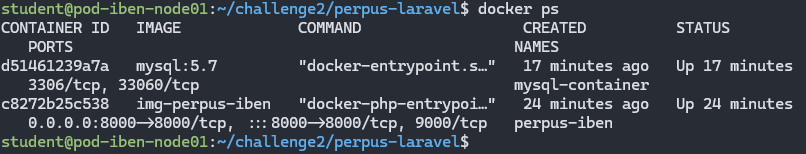

Pastikan kedua container (`perpus-iben` dan `mysql-container`) berada dalam jaringan yang sama, Karena disini kita tidak menggunakan `docker-compose` kita perlu menghubungkan kontainernya

```bash
# Memastikan network yang telah di buat ada
docker network ls
```

```bash
# Menghubungkan Kedua kontainer agar bisa saling terhubung
docker network connect laravel-network perpus-iben
docker network connect laravel-network mysql-container
```

```bash
# Mengecek cantainer apa saja yang terhubung di network laravel
docker network inspect laravel-network
```
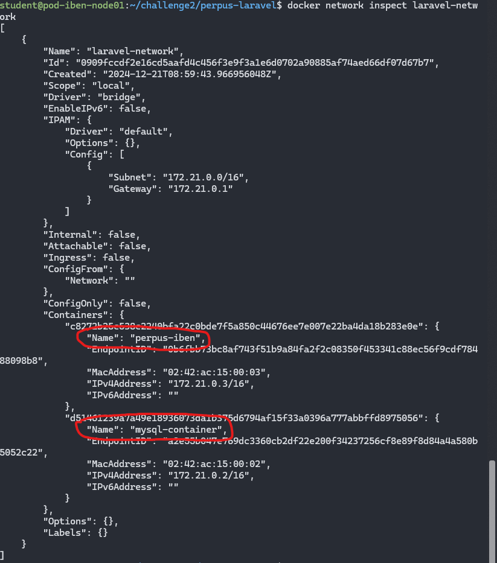

Setelah memastikan 2 container terhubung dengan network yang sama

```bash
# Masuk ke dalam container yang berjalan pastikan file .env sudah sesuai
docker exec -it perpus-iben bash
```
Pastikan file dari .env sudah sesuai
```bash
# Didalam directory Memeriksa isi .env
cat .env
```
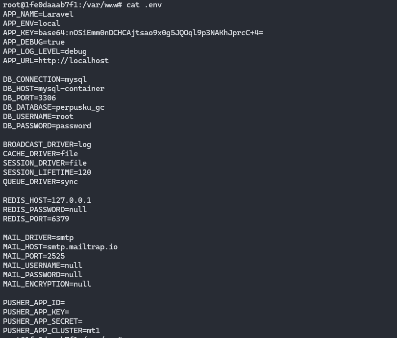

## Langkah 6. Menginstal dan Update Composer

```bash
# Masuk ke dalam container yang berjalan pastikan file .env sudah sesuai
docker exec -it perpus-iben bash
```

```bash
# Menginstal packages yang ada di dalam docker container
composer install
```
Jika mengalami seperti ini 

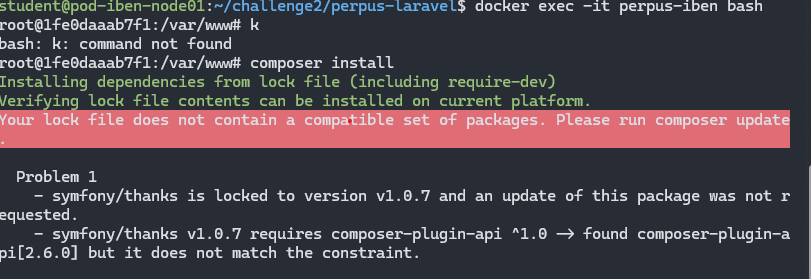

Masukkan:
```bash
# mengaupdate packages yang ada di docker container
composer update
```
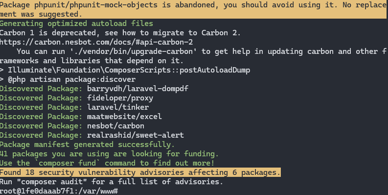

Sebelum mengakses perlu diperhatikan

Akses menggunakan `ip_server dan port yang berjalan`, disini saya menggunakan IP 10.10.10.11 dari VirtualBox

```bash
# Akses kedalam Browser
http://10.10.10.11:8000
```

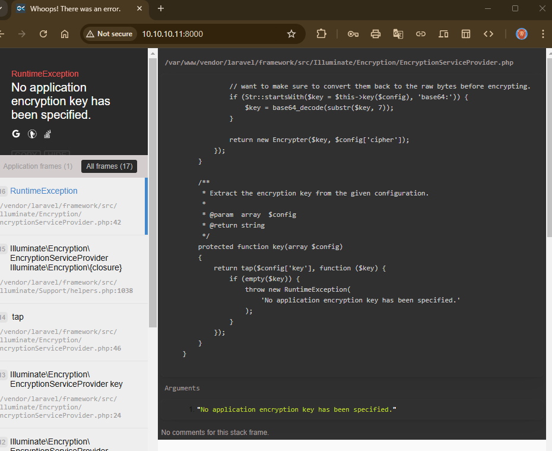

Jika error seperti ini masukkan `key` untuk `.env`, Error seperti ini di biasanya di akibatkan database belum di migrate dengan baik sehingga database tidak dapat terbaca.
```bash
php artisan key:generate
```
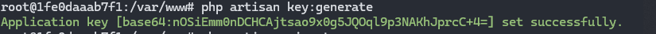
```bash
php artisan migrate
```
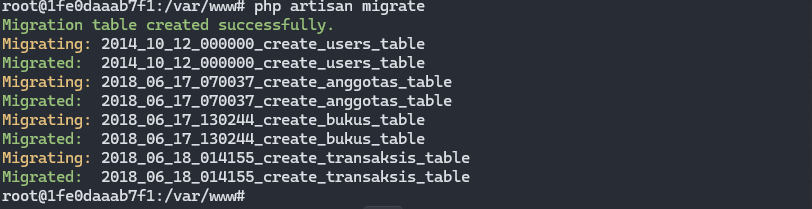

```bash
php artisan db:seed
```
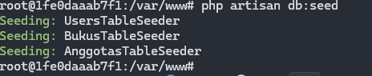


Setelah semuanya dijalankan dengan baik dan tidak ada error lagi tampilan web akan seperti berikut:
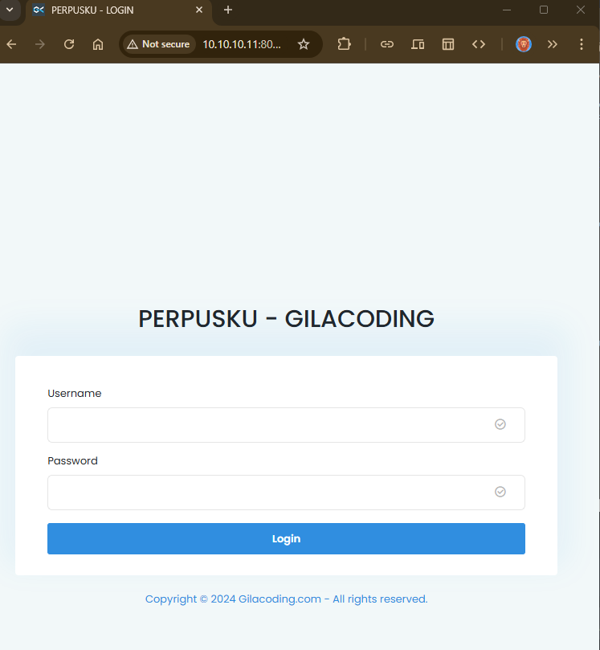
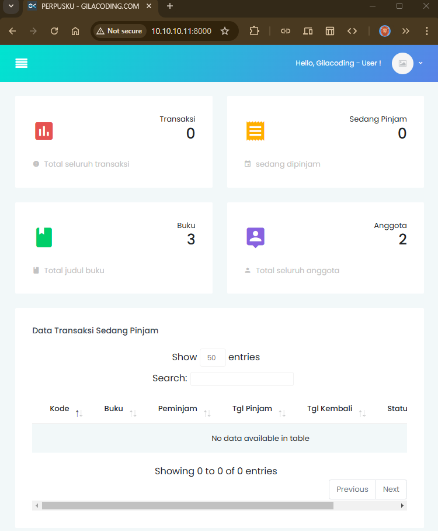


## <span style="color:lightblue;">Penutup</span>

<blockquote style="color:blue; background-color:lightgrey; padding:10px; border-left:5px solid blue;">
  Docker mempermudah proses deployment aplikasi Laravel dengan mengisolasi aplikasi dan dependensinya dalam kontainer, sehingga dapat dijalankan di berbagai lingkungan dengan konsistensi yang lebih baik
</blockquote>

<div style="background-color:lightgreen; padding:10px; border:1px solid green;">
</div>
